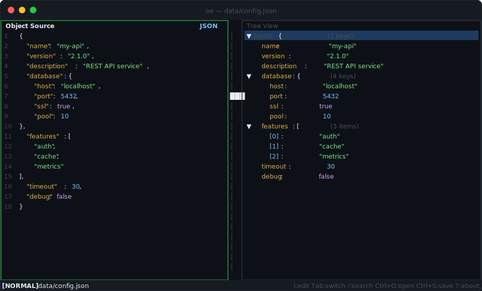
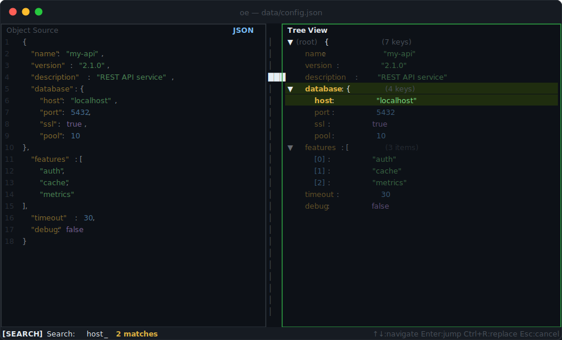
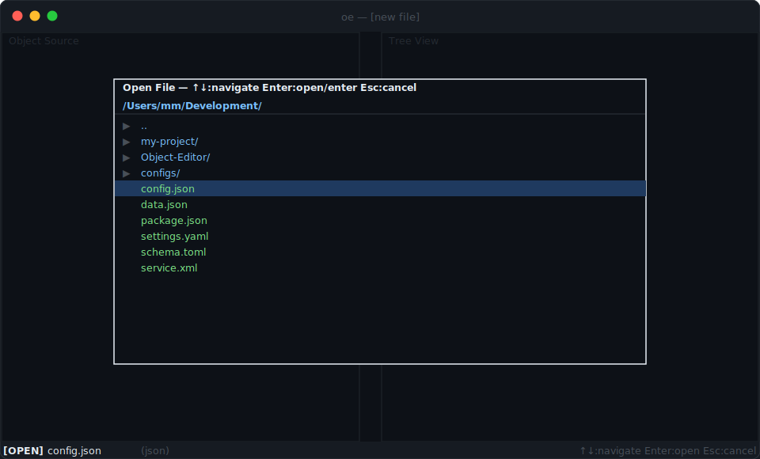

<div align="center">

# roe — Object Editor

**A dual-pane terminal editor for structured data, built with Rust + Ratatui.**


<br/>



_Normal mode → Tree navigation → Live search → Insert mode with bidirectional sync_

</div>

---

## What it is

`roe` opens any JSON, YAML, TOML, or XML file and presents it in two synchronized panes side by side: the raw text on the left (fully editable), and a collapsible tree navigator on the right. Editing either pane immediately updates the other.

The center strip is a unified scrollbar that moves both panes simultaneously.

---

## Screenshots

<table>
<tr>
<td align="center" width="50%">

**Normal mode — raw pane focused**



Full syntax highlighting with live tree sync. Green border = active pane.

</td>
<td align="center" width="50%">

**Search mode**



Press `/` anywhere to filter the tree. Matching keys highlight in yellow; non-matching nodes dim.

</td>
</tr>
<tr>
<td align="center" width="50%">

**File picker (`Ctrl+O`)**



Filesystem browser overlay. Directories and supported files only; hidden files excluded.

</td>
<td align="center" width="50%">

**Insert mode**

Edit raw text directly or use tree commands (`Enter` to edit a value, `a` to add, `d` to delete). The tree re-parses 250 ms after the last keystroke.

```
[INSERT]  config.json *
↑
Esc:normal  Ctrl+Z:undo  Ctrl+S:save
```

</td>
</tr>
</table>

---

## Prerequisites

**Rust toolchain** — `roe` is written in Rust and compiled from source. If you
don't have Rust installed:

```bash
# Install rustup (the Rust toolchain manager)
curl --proto '=https' --tlsv1.2 -sSf https://sh.rustup.rs | sh

# Follow the on-screen prompts, then reload your shell
source "$HOME/.cargo/env"

# Verify the install
rustc --version   # should print rustc 1.75.0 or newer
cargo --version
```

> **Windows**: use the installer from [rustup.rs](https://rustup.rs) instead of
> the curl command above.

No other system dependencies are required. All Rust crates are downloaded
automatically by Cargo during the build.

---

## Installation

### Clone and build

```bash
git clone https://github.com/tekanic/roe.git
cd roe

# Release build (optimised, ~2–3 MB binary)
cargo build --release
```

The compiled binary lands at `target/release/roe`.

### Run without installing

```bash
./target/release/roe path/to/file.json
```

### Install system-wide (optional)

```bash
# Copies the binary to ~/.cargo/bin, which is already on your PATH if you
# installed Rust with rustup
cargo install --path .

# Then run from anywhere
roe path/to/file.json
```

### Development build (faster compile, slower runtime)

```bash
cargo run -- path/to/file.json
```

---

## Usage

```bash
roe path/to/file.json    # open a JSON file
roe data.yaml            # open a YAML file
roe config.toml          # open a TOML file
roe                      # start with an empty document
```

`roe` opens in your terminal and takes over the full screen. Press `Ctrl+Q` to
quit at any time.

### The two panes

| Pane  | Name              | What it shows                                         |
| ----- | ----------------- | ----------------------------------------------------- |
| Left  | **Object Source** | The raw file text — fully editable                    |
| Right | **Tree View**     | A navigable, collapsible tree of the parsed structure |

Use `Tab` to move keyboard focus between them. The active pane has a **green
border**; the inactive pane is dimmed.

### Typical workflow

1. **Open a file** — pass it on the command line, or press `Ctrl+O` inside
   the editor to browse the filesystem.
2. **Navigate** — use the Tree View (`Tab` to focus it) to explore the
   structure. Arrow keys move through nodes; `Space` collapses/expands
   objects and arrays.
3. **Edit** — press `Tab` to switch to Object Source and `i` to start typing,
   or use the Tree View commands (`Enter` to edit a value, `a` to add a key,
   `d` to delete, `r` to rename) for structured edits.
4. **Search** — press `/` in the Tree View to filter nodes by key or value.
5. **Save** — `Ctrl+S` writes to disk. A `*` in the status bar means there
   are unsaved changes.

### Status bar

The single line at the bottom of the screen shows:

```
[MODE]  filename.json *  ⚠ parse error message   hint text
```

- **`[MODE]`** — current interaction mode (`NORMAL`, `INSERT`, `SEARCH`, etc.)
- **filename** + **`*`** — open file and unsaved-changes indicator
- **`⚠ …`** — parse error if the raw text is not valid (press `Ctrl+E` to jump
  to the error line)
- **hint text** — context-sensitive key reminders for the current mode

Files are auto-detected by extension. On open, the document is parsed and
pretty-printed with a canonical 2-space indent. Paste detection also tries
all supported formats automatically.

---

## Keybindings

### Global (any mode)

| Key      | Action                                     |
| -------- | ------------------------------------------ |
| `Ctrl+S` | Save to disk (prompts for filename if new) |
| `Ctrl+O` | Open file picker                           |
| `Ctrl+Q` | Quit (prompts if unsaved changes)          |
| `Ctrl+Z` | Undo                                       |
| `Ctrl+Y` | Redo                                       |
| `Ctrl+V` | Paste from clipboard                       |
| `Ctrl+E` | Jump raw pane cursor to parse error line   |
| `Tab`    | Switch focus between panes                 |
| `?`      | Toggle About / keybindings overlay         |

---

### Normal Mode — Raw Pane Focused

| Key               | Action                             |
| ----------------- | ---------------------------------- |
| `i`               | Enter Insert mode                  |
| Any printable key | Enter Insert mode and start typing |
| Double-click word | Select word and enter Insert mode  |

---

### Normal Mode — Tree Pane Focused

| Key                 | Action                                  |
| ------------------- | --------------------------------------- |
| `↑` / `k`           | Move cursor up one row                  |
| `↓` / `j`           | Move cursor down one row                |
| `PgUp`              | Move cursor up one page                 |
| `PgDn`              | Move cursor down one page               |
| `Home` / `g`        | Jump to first node                      |
| `End` / `G`         | Jump to last node                       |
| `Space` / `←` / `→` | Toggle collapse / expand container      |
| `Enter`             | Edit leaf value, or toggle container    |
| `a`                 | Add new key / array item                |
| `d`                 | Delete selected node (confirm required) |
| `r`                 | Rename selected key                     |
| `c`                 | Copy node value to clipboard            |
| `/`                 | Open search / filter bar                |

Tree navigation syncs the raw pane cursor to the corresponding line.

---

### Insert Mode (raw pane editing)

| Key            | Action                                          |
| -------------- | ----------------------------------------------- |
| `Esc`          | Return to Normal mode                           |
| `Ctrl+Z`       | Undo                                            |
| `Ctrl+Y`       | Redo                                            |
| All other keys | Standard text editing (arrows, backspace, etc.) |

The raw pane re-parses after 250 ms of inactivity. If valid, the tree
updates immediately. If invalid, the last good tree is preserved and a
parse error appears in the status bar.

---

### Tree Edit Mode (add / rename / edit value)

| Key         | Action                     |
| ----------- | -------------------------- |
| `Enter`     | Confirm the edit           |
| `Esc`       | Cancel                     |
| `Backspace` | Delete last character      |
| Any char    | Append to the input buffer |

Value input is first parsed as JSON; if it fails, the text is stored as a
plain string.

---

### Search Mode (`/`)

| Key      | Action                                        |
| -------- | --------------------------------------------- |
| Type     | Live-filter tree to matching keys / values    |
| `Enter`  | Jump to first match and return to Normal mode |
| `Ctrl+R` | Switch to Replace mode                        |
| `Esc`    | Clear filter and return to Normal mode        |

---

### Replace Mode (`Ctrl+R` from Search)

| Key      | Action                            |
| -------- | --------------------------------- |
| Type     | Build replacement string          |
| `Enter`  | Replace current match and advance |
| `Ctrl+A` | Replace all matches at once       |
| `Esc`    | Return to Search mode             |

---

### Confirm Mode

| Key       | Action         |
| --------- | -------------- |
| `y` / `Y` | Confirm action |
| Any other | Cancel         |

---

### Save As Mode (`Ctrl+S` with no file open)

| Key         | Action                                           |
| ----------- | ------------------------------------------------ |
| Type        | Build filename                                   |
| `Enter`     | Save (format extension auto-appended if omitted) |
| `Esc`       | Cancel                                           |
| `Backspace` | Delete last character                            |

---

### File Picker (`Ctrl+O`)

A centered overlay for browsing the filesystem. Directories and supported
files (`.json`, `.yaml`, `.toml`, `.xml`) are listed; hidden files are
excluded.

| Key       | Action                                   |
| --------- | ---------------------------------------- |
| `↑` / `k` | Move selection up                        |
| `↓` / `j` | Move selection down                      |
| `PgUp`    | Jump up one page                         |
| `PgDn`    | Jump down one page                       |
| `Enter`   | Enter directory or open highlighted file |
| `Esc`     | Close picker without opening             |

If there are unsaved changes, a confirmation prompt appears before
discarding them.

---

## Mouse Support

| Action                         | Result                                        |
| ------------------------------ | --------------------------------------------- |
| Click in raw pane              | Move cursor; tree scrolls to matching node    |
| Double-click word in raw pane  | Select word, enter Insert mode                |
| Click in tree pane             | Select node; raw pane cursor follows          |
| Double-click node in tree pane | Edit leaf / toggle container                  |
| Click `▶` / `▼` indicator      | Toggle collapse without changing selection    |
| Scroll wheel                   | Scrolls the **focused** pane only             |
| Click / drag center scrollbar  | Seeks both panes to the proportional position |
| Right-click                    | Transfer focus to the clicked pane            |
| Click outside file picker      | Dismiss picker                                |

---

## Architecture

```
src/
├── main.rs     Entry point, terminal setup, event loop, save/load
├── state.rs    AppState, Mode enum, UndoStack, Focus, FileEntry
├── tree.rs     JsonTree, FlatNode, collapse state, search filter, line sync
├── sync.rs     raw ↔ tree: parse, serialize, line-number lookup
├── format.rs   FileFormat codec: JSON, YAML, TOML, XML
├── events.rs   Input event routing by Mode, mouse handling, bidirectional sync
└── ui.rs       Pure Ratatui render function (no state mutation)
```

### Key design points

- **Single source of truth** — `AppState` is passed by `&mut` to event handlers
  and by `&` to the render function. No other copies of state exist.
- **Bidirectional sync** — clicking in either pane moves the cursor in the
  other. Line numbers are cached in `FlatNode` after every successful parse.
- **Debounced reparse** — the tree updates 250 ms after the last keystroke,
  avoiding a full reparse on every character.
- **Undo/redo** — full string snapshots, 100 levels, O(1) eviction via
  `VecDeque`.
- **Unified scrollbar** — a single `███` thumb in the center strip drives
  both panes proportionally; its position reflects the focused pane.

---

## Dependencies

| Crate          | Purpose                                 |
| -------------- | --------------------------------------- |
| `ratatui`      | TUI layout and widgets                  |
| `crossterm`    | Terminal backend, events, mouse support |
| `tui-textarea` | Editable text area widget               |
| `serde_json`   | JSON parsing and serialization          |
| `serde_yaml`   | YAML parsing and serialization          |
| `toml`         | TOML parsing and serialization          |
| `roxmltree`    | XML parsing (read-only)                 |
| `serde`        | Derive macros for format codecs         |
| `arboard`      | Clipboard read/write                    |
| `color-eyre`   | Pretty error reporting                  |
